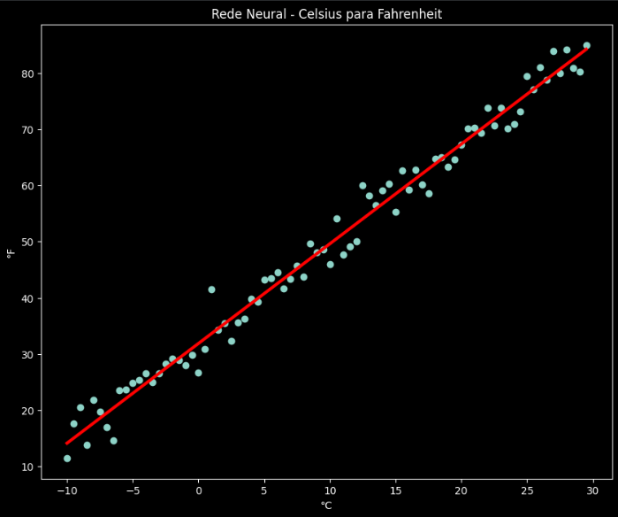

# 🧠 Rede Neural do Zero — Celsius para Fahrenheit

Este projeto implementa uma rede neural simples do zero utilizando Python, com o objetivo de aprender a relação entre temperaturas em Celsius e Fahrenheit.

O modelo foi desenvolvido sem o uso de bibliotecas prontas de Machine Learning, permitindo entender como funciona o aprendizado de um modelo passo a passo.

---

## 🎯 Objetivo

Compreender na prática como uma rede neural aprende a partir dos dados, ajustando seus parâmetros para minimizar o erro entre valores previstos e valores reais.

---

## ⚙️ Como o modelo funciona

O modelo aprende a relação linear entre Celsius e Fahrenheit usando a equação:

y = wx + b

Durante o treinamento, o modelo:

- Faz previsões (forward)
- Calcula o erro (MSE)
- Ajusta os parâmetros (backpropagation)
- Repete o processo por várias épocas (epochs)

---

## 🛠️ Tecnologias utilizadas

- Python  
- NumPy  
- Matplotlib  

---

## 📊 Resultado

O modelo aprende uma reta que se ajusta aos dados, representando corretamente a tendência entre Celsius e Fahrenheit.

